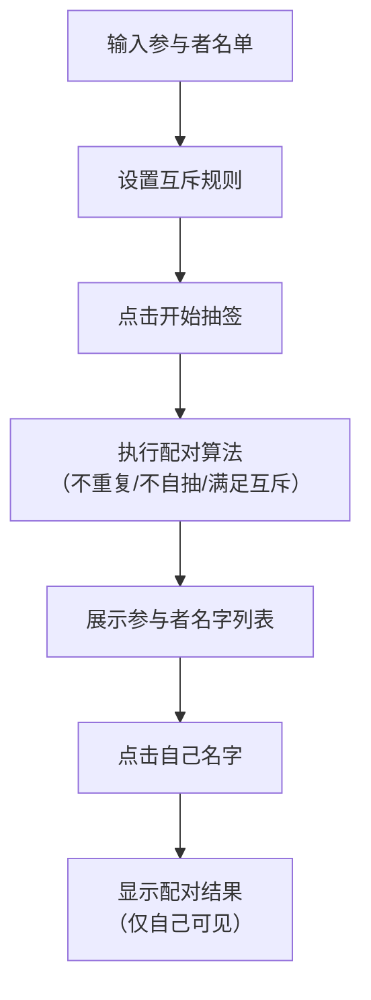

## 1. 产品概述

圣诞节/年会交换礼物抽签工具，解决聚会中交换礼物抽签配对容易重复、自己抽到自己、无法设置互斥规则等痛点。提供一键随机抽签、结果保密查看等功能，让礼物交换更有趣味性和仪式感。

- 主要用途：公司年会、朋友聚会、家庭圣诞派对等礼物交换场景
- 目标用户：活动组织者、参与礼物交换的所有人
- 核心价值：公平随机、规则灵活、结果保密、仪式感强

## 2. 核心功能

### 2.1 用户角色

| 角色 | 使用方式 | 核心权限 |
|------|----------|----------|
| 组织者 | 创建活动、设置规则、发起抽签 | 管理参与者名单、设置互斥规则、开始抽签 |
| 参与者 | 查看自己的抽签结果 | 只能查看自己抽到谁，不可见其他人结果 |

### 2.2 功能模块

1. **首页/设置页**：参与者名单输入、互斥规则设置、开始抽签按钮
2. **抽签动画页**：抽签过程动画效果，营造仪式感
3. **结果展示页**：参与者名字列表，点击自己名字查看配对结果

### 2.3 页面详情

| 页面名称 | 模块名称 | 功能描述 |
|-----------|-------------|---------------------|
| 设置页 | 参与者名单 | 输入/编辑参与者姓名，支持添加、删除、批量导入 |
| 设置页 | 互斥规则 | 设置不能互抽的配对（如夫妻、同部门等），支持多条规则 |
| 设置页 | 抽签按钮 | 一键开始抽签，算法保证不重复、不自抽、满足互斥 |
| 结果页 | 名字列表 | 展示所有参与者名字卡片，点击查看结果 |
| 结果页 | 结果弹窗 | 点击名字后显示"你抽到的是：XXX"，带庆祝动效 |

## 3. 核心流程

用户输入参与者名单 → 设置互斥规则 → 点击开始抽签 → 系统执行随机配对算法 → 展示参与者名字列表 → 每人点击自己名字查看结果

## 4. 用户界面设计

### 4.1 设计风格

- **主色调**：圣诞红 (#C41E3A) + 森林绿 (#0B6623) + 金色 (#D4AF37)，营造浓厚节日氛围
- **辅助色**：雪白 (#FFFAF0) + 银色 (#C0C0C0)
- **按钮风格**：圆润立体按钮，带有金色边框和光泽效果，点击有弹性动画
- **字体**：标题使用装饰性手写字体（如 Ma Shan Zheng），正文使用优雅衬线字体
- **布局风格**：卡片式布局，带有雪花/礼物等节日装饰元素
- **图标风格**：使用节日主题emoji和精美图标

### 4.2 页面设计概述

| 页面名称 | 模块名称 | UI 元素 |
|-----------|-------------|----------|
| 设置页 | 顶部标题 | 大标题"礼物交换抽签"，带圣诞帽装饰，雪花飘落动效 |
| 设置页 | 参与者输入 | 列表式输入框，每个名字一个卡片，支持删除 |
| 设置页 | 互斥规则 | 双人选择器，成对展示，支持添加多对 |
| 设置页 | 抽签按钮 | 大尺寸金色按钮，礼物盒图标，悬停发光效果 |
| 结果页 | 名字网格 | 响应式网格布局，每张卡片一个名字，翻转效果 |
| 结果页 | 结果弹窗 | 居中弹窗，金色丝带装饰，放大展示抽到的名字 |

### 4.3 响应式

桌面端优先设计，移动端自适应。卡片在桌面端多列展示，移动端单列展示。触控区域不小于 48px。

### 4.4 动画与交互

- 页面加载：雪花飘落动画，标题渐入
- 抽签过程：名字滚动/洗牌动画，礼物盒打开效果
- 结果展示：卡片翻转动画，彩带喷射效果
- 悬停效果：卡片微抬升，发光边框
