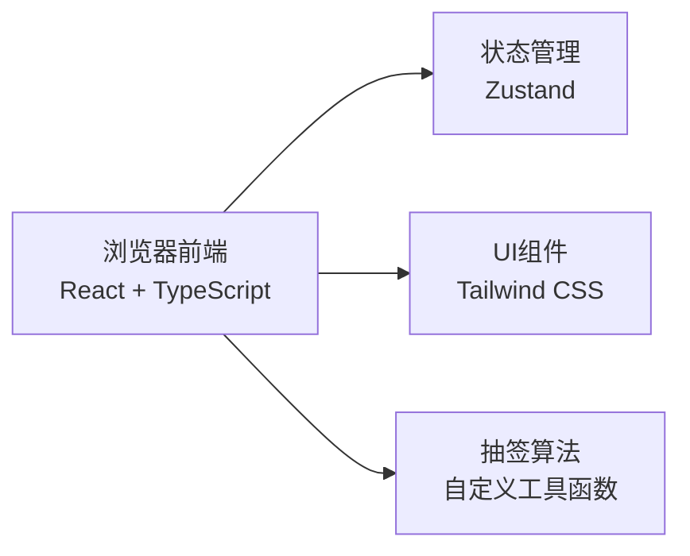

## 1. 架构设计

纯前端单页应用，所有逻辑在浏览器端执行，无需后端服务。数据存储在本地状态中，确保隐私性。



## 2. 技术描述

- **前端**: React@18 + TypeScript + Vite
- **样式**: Tailwind CSS 3
- **状态管理**: Zustand
- **路由**: React Router DOM
- **图标**: Lucide React
- **后端**: 无（纯前端应用）
- **数据库**: 无（本地状态存储）

## 3. 页面与路由

| 路由 | 页面 | 功能 |
|-------|------|------|
| / | 首页/设置页 | 输入参与者名单、设置互斥规则、开始抽签 |
| /result | 结果页 | 展示参与者列表，点击查看抽签结果 |

## 4. 核心数据模型

### 4.1 参与者

```typescript
interface Participant {
  id: string;
  name: string;
}
```

### 4.2 互斥规则

```typescript
interface ExclusionRule {
  id: string;
  participant1Id: string;
  participant2Id: string;
}
```

### 4.3 抽签结果

```typescript
interface DrawResult {
  [giverId: string]: string; // giverId -> receiverId
}
```

### 4.4 应用状态

```typescript
interface AppState {
  participants: Participant[];
  exclusionRules: ExclusionRule[];
  drawResult: DrawResult | null;
  isDrawing: boolean;
  revealedIds: Set<string>; // 已查看结果的参与者ID
}
```

## 5. 核心算法

### 5.1 配对算法（带互斥约束的 derangement）

1. 生成所有参与者的随机排列
2. 检查是否满足约束：
   - 每个人不能抽到自己（derangement 条件）
   - 不能违反互斥规则
3. 如果不满足，重新生成排列，直到找到有效解
4. 设置最大重试次数，避免无限循环
5. 如果无法找到有效解，提示用户调整规则

### 5.2 算法优化

- 使用 Fisher-Yates 洗牌算法保证随机性
- 对于小规模参与者（< 50人），暴力重试足够高效
- 加入失败检测：当互斥规则过多导致无解时，友好提示

## 6. 项目结构

```
src/
├── components/          # 可复用组件
│   ├── Snowflakes.tsx   # 雪花飘落动画
│   ├── ParticipantCard.tsx
│   ├── ExclusionRuleItem.tsx
│   ├── DrawAnimation.tsx
│   └── ResultModal.tsx
├── pages/               # 页面组件
│   ├── SetupPage.tsx
│   └── ResultPage.tsx
├── store/               # 状态管理
│   └── useAppStore.ts
├── utils/               # 工具函数
│   └── drawAlgorithm.ts
├── types/               # 类型定义
│   └── index.ts
├── App.tsx
├── main.tsx
└── index.css
```
